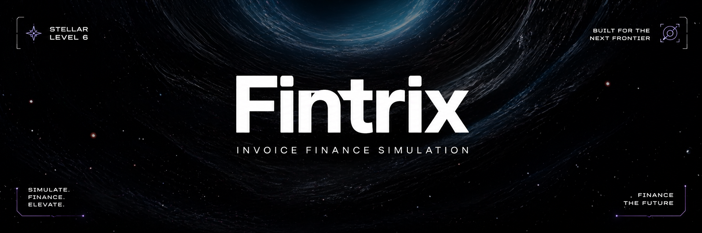
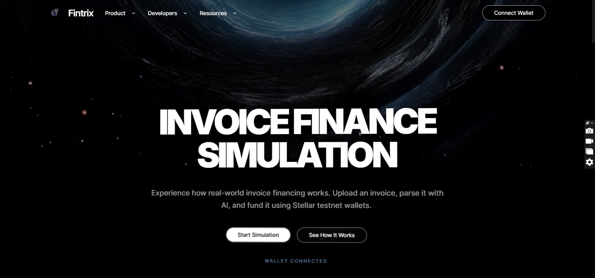
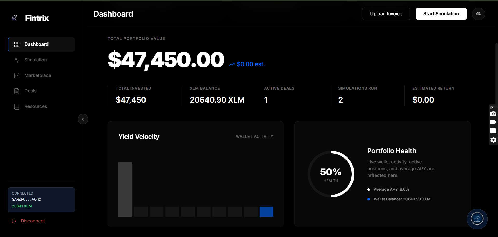
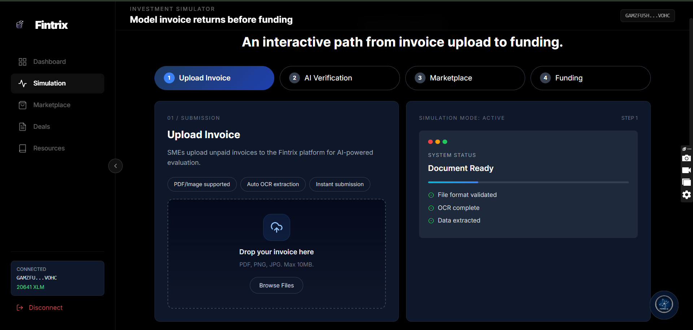
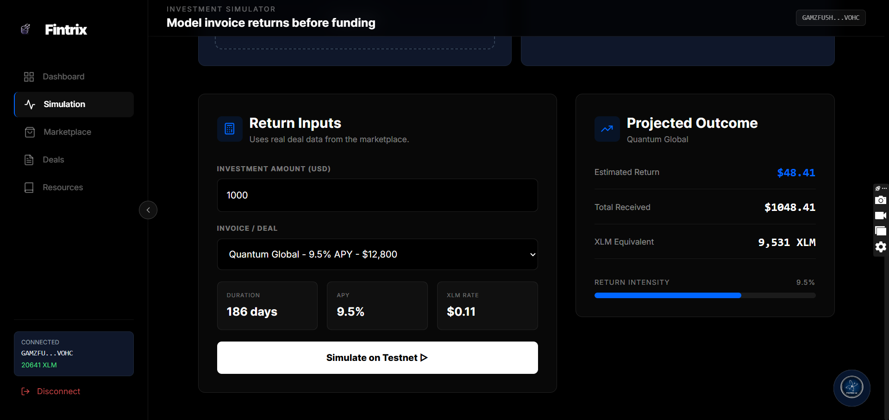
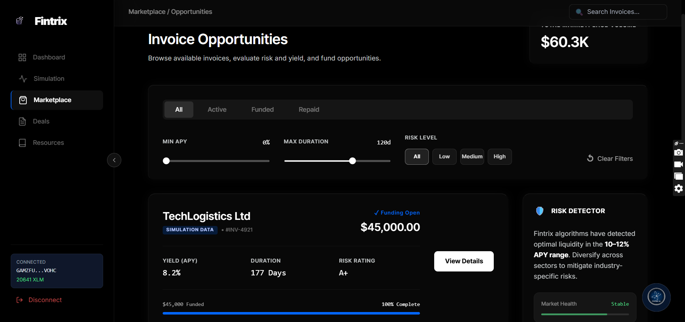
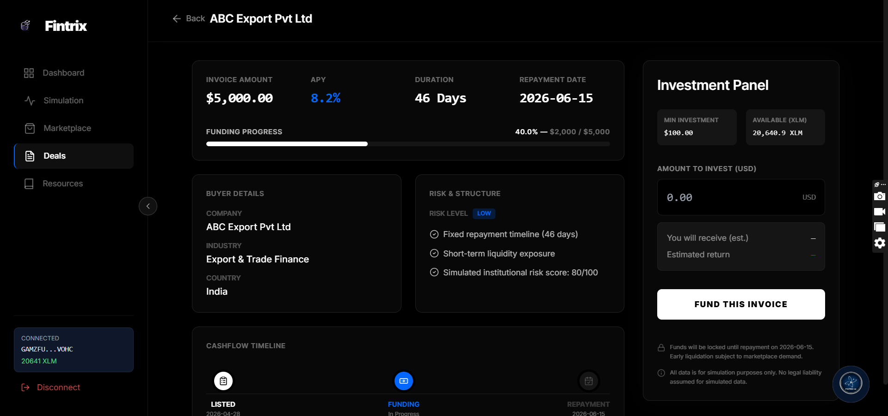
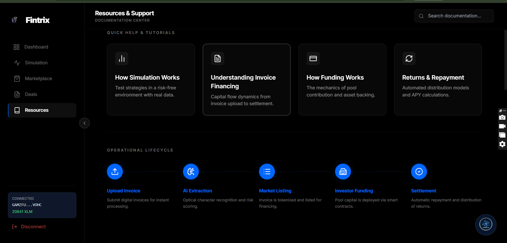

<div align="center">

<br/>



### AI-Powered Invoice Financing on Stellar Blockchain


<br/>

[](https://stellar.org)
[](https://react.dev)
[](https://typescriptlang.org)
[](https://nodejs.org)
[](https://vitejs.dev)
[](LICENSE)


[](https://fintrix-frontend-r4hn.vercel.app/)
[](https://docs.google.com/spreadsheets/d/1Z_g-usNOPdgCqJD8ugVWBnagJsbDabLCqWhYH1XF3yA/edit?gid=13758662#gid=13758662)
[]()

<br/>

[🎬 **Watch Demo**](https://www.loom.com/share/037db37052904d3da5d18dc3da95d31e) &nbsp;|&nbsp;
[🔴 **Live App**](https://fintrix-invoicee.vercel.app/) &nbsp;|&nbsp;
[⚙️ **CI/CD Pipeline**](https://github.com/vaibhavi-0320/StellerFund/actions) &nbsp;|&nbsp;
[📋 **User Feedback**](https://docs.google.com/spreadsheets/d/1Z_g-usNOPdgCqJD8ugVWBnagJsbDabLCqWhYH1XF3yA/edit?gid=13758662#gid=13758662) &nbsp;|&nbsp;
[📝 **Feedback Form**](https://docs.google.com/forms/d/e/1FAIpQLSd0gPeNOEnbcRU0Ld6SxiL9ShnmChXzCGci0pdPFaqKBft8LQ/viewform?usp=header) &nbsp;|&nbsp;
[🔍 **Stellar Explorer**](https://stellar.expert/explorer/testnet)

<br/>

</div>

---

## What is Fintrix?

> Invoice financing is a **$3 trillion global market** locked inside banks, credit brokers, and opaque intermediaries. Businesses wait 30 to 90 days to get paid on invoices they have already earned. Investors have no transparent, accessible way to evaluate or fund that risk.
>
> Fintrix puts the entire lifecycle on-chain. SMEs upload invoices. AI scores every risk dimension in real time. Investors fund them using Stellar testnet wallets and earn APY yield. Every transaction is transparent, every position is trackable, and no bank is involved.

```
  SME uploads invoice
         │
         ▼
  AI extracts & scores (OCR + Trust Score)
         │
         ▼
  Invoice listed on Marketplace
         │
         ▼
  Investor reviews yield, risk, duration
         │
         ├── Risk too high? → AI warns before funding
         │
         ▼
  Investor commits XLM via Stellar testnet wallet
         │
         ▼
  Funding progress tracked on-chain
         │
         ▼
  Repayment date reached → position closed → yield distributed
```

---

## Table of Contents

- [Platform Overview](#platform-overview)
- [Live Screenshots](#live-screenshots)
- [Key Features](#key-features)
- [How Invoice Finance Simulation Works](#how-invoice-finance-simulation-works)
- [Architecture](#architecture)
- [Tech Stack](#tech-stack)
- [Project Structure](#project-structure)
- [Stellar & Blockchain Integration](#stellar--blockchain-integration)
- [AI Assistant & Risk Detector](#ai-assistant--risk-detector)
- [User Onboarding & Feedback](#user-onboarding--feedback)
- [Platform Metrics](#platform-metrics)
- [Security](#security)
- [CI/CD Pipeline](#cicd-pipeline)
- [Quick Start](#quick-start)
- [Deployment](#deployment)
- [Documentation Index](#documentation-index)
- [License](#license)

---

## Platform Overview

Fintrix is built around one idea: **make invoice financing as transparent as a blockchain transaction.**

The platform operates as a full simulation environment — meaning every flow (upload, verify, list, fund, repay) mirrors how a real institutional invoice financing platform works, but runs safely on Stellar Testnet with no real capital at risk.

### Core Flows

<div align="center">

| <span style="color:#4fc3f7">Flow</span> | <span style="color:#4fc3f7">Who Uses It</span> | <span style="color:#4fc3f7">What Happens</span> |
|:--|:--|:--|
| Invoice Upload | SME / Business | Upload PDF or image invoice, AI extracts data via OCR |
| AI Verification | System | Trust Score computed across 5 risk dimensions |
| Marketplace Listing | Both | Invoice listed with yield, duration, risk rating |
| Investment | Investor | Commit XLM, see projected return, sign transaction |
| Portfolio Tracking | Investor | Live view of funded positions and expected settlement |
| Repayment | System | Position closes on maturity date, yield calculated |
| Simulation | Both | Test funding scenarios safely before committing |

</div>

---

## Live Screenshots

### Landing Page

> *Cinematic space-themed hero. Clean navigation. Two clear CTAs: Start Simulation and See How It Works.*

### Dashboard

> *Full portfolio view with live XLM balance, total invested, active deals, simulations run, and estimated return — all wired to the connected Stellar wallet.*

### Invoice Upload 

> *Drag-and-drop invoice upload with PDF/PNG/JPG support. Right panel shows live system status: OCR complete, data extracted, document ready.*

### Investment Simulator

> *Enter investment amount, select deal, and see projected outcome with APY, XLM equivalent, and return intensity bar — all before touching a real wallet.*

### Marketplace

> *Browse all open funding opportunities with yield, duration, risk rating, and funding progress.*

### Deal Detail & Investment Panel

> *Full deal breakdown: buyer details, cashflow timeline, risk structure, and the Investment Panel to fund the invoice with one click.*

### Resources & Documentation Center

> *In-app documentation: How Simulation Works, Invoice Financing explained, Funding mechanics, Returns & Repayment.*

---

## Key Features

<div align="center">

| Feature | Description |
|:--|:--|
| 🧾 **Invoice Marketplace** | Browse real-time funding opportunities filtered by risk, yield, sector, and duration |
| 🤖 **AI Risk Detector** | Proactive warning layer that analyses invoices before every funding decision |
| 📄 **OCR Invoice Parsing** | Upload PDF or image — AI extracts vendor, amount, dates, and terms automatically |
| 💰 **Funding Workflow** | Commit XLM to invoices with Stellar wallet signing and on-chain confirmation |
| 📊 **Investment Simulator** | Model any investment scenario with interactive sliders before committing funds |
| 🔁 **Repayment Lifecycle** | Track active positions from funding through settlement with cashflow timeline |
| 🧪 **Simulation Command Center** | Run full invoice financing scenarios safely on Stellar Testnet |
| 📈 **Live Dashboard** | Real XLM balance, portfolio value, active deals, simulations run — all live |
| 👛 **Stellar Wallet Integration** | Connect wallet, view balance, sign transactions — all in-browser |
| 🏦 **Trust Score System** | Multi-dimensional scoring across payment history, invoice credibility, and business behavior |
| 📱 **Mobile Responsive** | Fluid layout, hamburger navigation, clamp() typography — every screen size |
| 🔐 **Security Layer** | Input validation, safe fallbacks, no server-side key storage, HTTPS only |
| 🔁 **CI/CD** | GitHub Actions validates and deploys on every push to main |
| 📚 **In-App Documentation** | Resources center with tutorials, FAQ, operational lifecycle, and technical docs |

</div>

---

## How Invoice Finance Simulation Works

### Step 1 — Upload Invoice

```
User selects PDF / PNG / JPG (max 10MB)
         │
         ▼
File validated client-side (format + size check)
         │
         ▼
OCR engine extracts:
  → Vendor name      → Invoice amount
  → Issue date       → Due date
  → Payment terms    → Reference number
         │
         ▼
Right panel updates live:
  ✅ File format validated
  ✅ OCR complete
  ✅ Data extracted
  → Status: Document Ready
```

### Step 2 — AI Verification & Trust Score

```
┌─────────────────────────────────────────────────────────┐
│                    TRUST SCORE ENGINE                   │
├──────────────────────┬──────────────────────────────────┤
│  DIMENSION           │  WHAT IT MEASURES                │
├──────────────────────┼──────────────────────────────────┤
│  Payment History     │  Has the buyer paid on time?     │
│  Invoice Credibility │  Does the invoice look authentic?│
│  Business Behavior   │  Is this SME consistent?         │
│  Sector Risk         │  Risk profile of the industry?   │
│  Counterparty Profile│  Buyer's repayment track record? │
└──────────────────────┴──────────────────────────────────┘

Output:
  → Risk Rating: A+ / A / B / C
  → Trust Score: 0–100
  → AI Recommendation: Fund / Review / Avoid
```

### Step 3 — Investment & Funding

```
Investor clicks "Fund This Invoice"
         │
         ▼
Stellar SDK builds transaction in frontend:
  → Source: Investor wallet public key
  → Destination: Escrow / SME wallet
  → Asset: XLM (native) · Network: Stellar Testnet
         │
         ▼
Freighter wallet signs XDR locally (key never leaves device)
         │
         ▼
Transaction submitted → Hash returned
         │
         ▼
UI updates ONLY after confirmed hash:
  → Funding progress bar increments
  → Position appears in investor portfolio
  → Transaction recorded with hash + timestamp
```

---

## Architecture

```
┌──────────────────────────────────────────────────────────┐
│                     User's Browser                       │
│   React 19  ·  TypeScript 5.x  ·  Tailwind CSS          │
│   Vite  ·  Framer Motion  ·  Custom Cursor               │
└─────────────────────────┬────────────────────────────────┘
                          │
                          ▼
┌──────────────────────────────────────────────────────────┐
│               Freighter Browser Extension                │
│   Builds transactions  ·  Signs locally                  │
│   Private key NEVER leaves the device                    │
└─────────────────────────┬────────────────────────────────┘
                          │  Signed XDR
                          ▼
┌──────────────────────────────────────────────────────────┐
│              Node.js Backend Service                     │
│   REST API  ·  Invoice management                        │
│   Transaction records  ·  AI assistant proxy             │
│   Trust Score engine  ·  GET /api/health                 │
└─────────────────────────┬────────────────────────────────┘
                          │  Stellar SDK v14
                          ▼
┌──────────────────────────────────────────────────────────┐
│          Stellar Horizon · Stellar Testnet               │
│   horizon-testnet.stellar.org                            │
│   Transaction verification · Account state               │
└──────────────────────────────────────────────────────────┘
```

---

## Tech Stack

<div align="center">

| Layer | Technology | Version | Purpose |
|:--|:--|:--|:--|
| Frontend Framework | React | 19 | UI component system |
| Language | TypeScript | 5.x | Type safety, strict mode |
| Build Tool | Vite | Latest | Fast dev server and production build |
| Styling | Tailwind CSS | 3.x | Utility-first responsive design |
| Animation | Framer Motion | Latest | Page transitions and micro-animations |
| Blockchain | Stellar SDK | v14 | Transaction building, account management |
| Wallet | Freighter Extension | Latest | Browser-based key management and signing |
| Backend | Node.js + Express | Latest | REST API, data persistence, AI proxy |
| AI Layer | OpenAI / Claude | Latest | Invoice risk scoring, chatbot assistant |
| Deployment | Vercel | — | Frontend hosting with SPA rewrite rules |
| CI/CD | GitHub Actions | — | Lint, build, and deploy on every push |
| Storage | JSON persistence | — | Invoices, transactions, visitor telemetry |

</div>

---

## Stellar & Blockchain Integration

### Wallet Connection

```typescript
import { getPublicKey, isConnected } from '@stellar/freighter-api';

const connectWallet = async () => {
  const connected = await isConnected();
  if (!connected) throw new Error('Freighter not installed');
  const publicKey = await getPublicKey();
  const account = await server.loadAccount(publicKey);
  const xlmBalance = account.balances
    .find(b => b.asset_type === 'native')?.balance || '0';
};
```

### Payment Transaction

```typescript
const server = new StellarSdk.Horizon.Server('https://horizon-testnet.stellar.org');
const sourceAccount = await server.loadAccount(investorPublicKey);

const transaction = new StellarSdk.TransactionBuilder(sourceAccount, {
  fee: await server.fetchBaseFee(),
  networkPassphrase: StellarSdk.Networks.TESTNET
})
.addOperation(StellarSdk.Operation.payment({
  destination: smePublicKey,
  asset: StellarSdk.Asset.native(),
  amount: xlmAmount.toString()
}))
.setTimeout(30)
.build();

// Signed locally in Freighter — secret key never leaves device
const signedXDR = await signTransaction(transaction.toXDR());
const result = await server.submitTransaction(
  StellarSdk.TransactionBuilder.fromXDR(signedXDR, StellarSdk.Networks.TESTNET)
);

if (result.hash) {
  setTxHash(result.hash); // UI updates ONLY after confirmed hash
}
```

### Verify any transaction live

```
https://stellar.expert/explorer/testnet/tx/{TRANSACTION_HASH}
```

---

## AI Assistant & Risk Detector

```
TRUST SCORE RATING SCALE

  90–100  ██████████  A+  Institutional Grade
  75–89   ████████    A   Low Risk
  60–74   ██████      B   Moderate Risk — Review Suggested
  40–59   ████        C   High Risk — AI Warning Triggered
  0–39    ██          D   Do Not Fund — AI Blocks Suggestion

Score weights:
  Payment History      → 25%
  Invoice Credibility  → 25%
  Business Behavior    → 20%
  Sector Risk          → 15%
  Counterparty Profile → 15%
```

---

## User Onboarding & Feedback

<div align="center">

> 📋 **[Submit Feedback](https://docs.google.com/forms/d/e/1FAIpQLSd0gPeNOEnbcRU0Ld6SxiL9ShnmChXzCGci0pdPFaqKBft8LQ/viewform?usp=header)** &nbsp;·&nbsp; **[View All Responses](https://docs.google.com/spreadsheets/d/1Z_g-usNOPdgCqJD8ugVWBnagJsbDabLCqWhYH1XF3yA/edit?gid=13758662#gid=13758662)**

</div>

> **All 30 beta testers below are real users who connected their actual Stellar testnet wallets to evaluate Fintrix.** Their wallet addresses are verifiable on the Stellar Testnet Explorer. Each completed the full onboarding flow: wallet connection, invoice simulation, marketplace exploration, and deal review.

<div align="center">

| # | Wallet | Name | Rating | Feedback |
|:-:|:--|:--|:-:|:--|
| 1 | [GAG...W2CQ3](https://stellar.expert/explorer/testnet/account/GAGBMRVUN2IBMXJUFNGRD7BHWYQACCGXDVV6X4GXTNXQC5DGCRMW2CQ3) | Divesh Dongare | ⭐ 5/5 | *"Excellent app, loved it."* |
| 2 | [GD2...EA3PJ](https://stellar.expert/explorer/testnet/account/GD2CFOJ4ZMWDE4WBUBP3Z6WRDPWMUAT5B2FK2BQSBCIWV3USTCXEA3PJ) | Durvesh Dongare | ⭐ 5/5 | *"Very good."* |
| 3 | [GAG...6FFX](https://stellar.expert/explorer/testnet/account/GAGKWDKAZYZ7GSK2K6YZGGEDEZXL2GEHDU2NMOAU4AVHSFAVZH336FFX) | Mrunal Ghorpade | ⭐ 5/5 | *"No feedback — excellent UI."* |
| 4 | [GDH...LMWZ](https://stellar.expert/explorer/testnet/account/GDHOWWJM3ZU7XN7BF7IQFFXXFNN3Y2ZL7I4253F5KHTA5FFN57SFLMWZ) | Samruddhi Nevse | ⭐ 4/5 | *"Good application."* |
| 5 | [GBT...JAQC](https://stellar.expert/explorer/testnet/account/GBTCO5WSTBEMWTLI7CXNDMFHJV7NTIPIAHTPRRNW3LC5HDNZI6M5JAQC) | Nayan Palande | ⭐ 5/5 | *"Fast and efficient performance."* |
| 6 | [GUF...T6K5](https://stellar.expert/explorer/testnet/account/GUFDJ23MIR2KR6FC3VTKA7YTCLJAJY5GL2UIX35HCFCZUPJCW7ZT6K5) | Shubham Golekar | ⭐ 5/5 | *"Good."* |
| 7 | [GDH...LMWZ](https://stellar.expert/explorer/testnet/account/GDHOWWJM85U7XN7BF7IQFFXXFNN3Y2ZL7I4253F5KHTA5FFN57SFLMWZ) | Om Golekar | ⭐ 5/5 | *"Good — it's nice."* |
| 8 | [GCA...3LDY](https://stellar.expert/explorer/testnet/account/GCATAASNFHODIKA4VTIEZHONZB3BGZJL42FXHHZ3VS6YKX2PCDIJ3LDY) | Harshal Jagdale | ⭐ 4/5 | *"Amazing working."* |
| 9 | [GBO...XQAS](https://stellar.expert/explorer/testnet/account/GBOWXQJBUZNIQ5V4CYCNTXWQB6EOBSUMIUJBBAZ452YVFXLUPVMTXQAS) | Satish Agale | ⭐ 5/5 | *"Best application for understanding invoice financing."* |
| 10 | [GBZ...CCRO](https://stellar.expert/explorer/testnet/account/GBZUXXUYXYO3V7OJUSNZRWD4YSS6X4VBI6LA2GVIP2YI3DWQXZKACCRO) | Shubhangi Agale | ⭐ 4/5 | *"The marketplace section is lagging. Improve the marketplace page."* |
| 11 | [GCE...IZ27](https://stellar.expert/explorer/testnet/account/GCEUIM5JT65THJO6TCRNH37VYPXNJQ7NQICETMV7235R4JARE3PTIZ27) | Tanishq Ahire | ⭐ 5/5 | *"Amazing. Nothing, this is so good."* |
| 12 | [GA3...EJBO](https://stellar.expert/explorer/testnet/account/GA3PMUXWSCWLT2FMQ76PODPODHLJHOWAHTD7JGOWHGGE5FZ3WWF6EJBO) | Jayatee Nanaware | ⭐ 5/5 | *"Excellent."* |
| 13 | [GCX...L52M](https://stellar.expert/explorer/testnet/account/GCXZBKGVR5XATK2CVCXOXMHOBYUYLH5OUBADSMP4XN2ID6TN6N7ZL52M) | Dnyaneshwari Gawade | ⭐ 5/5 | *"Unique and interesting."* |
| 14 | [GCP...LYLZ](https://stellar.expert/explorer/testnet/account/GCPQV7JCPIEQNXYRY54BCT3M7L24EM5XVJNSQAGXRFOKQJI7Z3E6LYLZ) | Savita Waghmare | ⭐ 4/5 | *"Very easy to navigate."* |
| 15 | [GAY...4MV](https://stellar.expert/explorer/testnet/account/GAYO3AHUNNQDP6RRZG4OAGBLY723JKAEDYQ247Q65XIFBVHDRGXXX4MV) | Shravasti Dolas | ⭐ 5/5 | *"Something new I learned. Performance is also good."* |
| 16 | [GAF...TYPH](https://stellar.expert/explorer/testnet/account/GAF4SUBPSJL6QATQILXS6JK7X4A6J6FA3UXOR2A2FQM6U2QMQNJ5TYPH) | Sampada Agale | ⭐ 4/5 | *"Good."* |
| 17 | [GCL...QREY](https://stellar.expert/explorer/testnet/account/GCLNJPXUXC5QYY47CPZZUAHKAXSFKKI2X4EUEAMPRDKD6OLRGXQQQREY) | Diya Kamble | ⭐ 4/5 | *"Nice, could be a bit better."* |
| 18 | [GBI...XE2P](https://stellar.expert/explorer/testnet/account/GBIXQLFE54OK32JKGLK3MLEAJ35IIX6RVHJV4YWALBCWKEYXOWEDXE2P) | Payal Bhaskar | ⭐ 5/5 | *"Very professional and super easy to use."* |
| 19 | [GBU...5MG](https://stellar.expert/explorer/testnet/account/GBUDUGMHCM7B54DIB5P5LP4PP6MG7MJ6VUBBYDB53BZNZCTH36LLG5MG) | Ayush Gaikwad | ⭐ 5/5 | *"Great."* |
| 20 | [GAN...HBS](https://stellar.expert/explorer/testnet/account/GANBGUREB5ZAY26ZIAB6VHVQ7CG4KNQMEILZUG2ZWLEPF3DUARLMRHBS) | Pallavi Patil | ⭐ 3/5 | *"The simulation can be improved."* |
| 21 | [GBT...BDH](https://stellar.expert/explorer/testnet/account/GBTBZDY7OIOYMINOYHHZVHGJOASPL4BQL5U4B6NP3LLHMKDXO6BSYBDH) | Aadesh Khande | ⭐ 5/5 | *"Really impressed with the clean UI and intuitive dashboard."* |
| 22 | [GCG...YSG7](https://stellar.expert/explorer/testnet/account/GCG4FCF4UB74JJXVWHFXIENK6DKGIXQZ3563RRMK2VH5EU4TBEM7YSG7) | Sumit Borhade | ⭐ 5/5 | *"Good practical understanding of invoice financing concepts."* |
| 23 | [GAM...V3S](https://stellar.expert/explorer/testnet/account/GAMIWMVB2OB664LIHCXRVQSWRXZRO2FPGKBQJPRZBT3IRUWLPBQ5IV3S) | Anushka Kachare | ⭐ 4/5 | *"AI chatbot should also fill in the invoices."* |
| 24 | [GC4...HXQHXU](https://stellar.expert/explorer/testnet/account/GC4ZTVK5FNZGYOYY2ZMIGCBKGYUVNUPA2VNMPYQ7TIK7X5QFZK7XQHXU) | Divya Bangar | ⭐ 5/5 | *"Great website, useful for businesses!"* |
| 25 | [GCE...ZLOM](https://stellar.expert/explorer/testnet/account/GCED4SM5H2Q3BD4OPVB3N5GPH3MFV5XLJQGSVJBLUFHKOMLSF62KZLOM) | Sunil Deshmukh | ⭐ 5/5 | *"Good website. Need more fintech work."* |
| 26 | [GDV...KNQZ](https://stellar.expert/explorer/testnet/account/GDVWBCONSGCEOUSUVZUUWX3IBTWZWNH2VPMZLCZSCEVPQDYAMCDAKNQZ) | Monika Patil | ⭐ 5/5 | *"Great website, amazing UI."* |
| 27 | [GB2...RW4](https://stellar.expert/explorer/testnet/account/GB2NMCOSIN2VG6MNZ5WQTJHU22FI44UDYGNZNYPNURULV76FFEVSBRW4) | Prachi Tambe | ⭐ 5/5 | *"Good design."* |
| 28 | [GDH...G6RC](https://stellar.expert/explorer/testnet/account/GDHAIVOS3IQ6VJTOKT32YZ6TBH54C3HQGM7XEISZ6XSY73TJMU2BG6RC) | Sutar Kiran | ⭐ 5/5 | *"Awesome website."* |
| 29 | [GC5...4DKF](https://stellar.expert/explorer/testnet/account/GC5TLPV6W66NMLXJICXLAKKBXF4ONT72REHSUIWZTH6OEBF45I4L4DKF) | Shekhar Agale | ⭐ 4/5 | *"I like the design. Are PDFs really the best way to input invoices?"* |
| 30 | [GB2...5SOV](https://stellar.expert/explorer/testnet/account/GB2FK6UX2HC7U2LFML6OZFJLJGFUCX7S37EZDVA5MPM5O5D5NLH65SOV) | Meghiya Tulse | ⭐ 3/5 | *"Good work."* |

</div>

<div align="center">

📝 **[Submit Your Feedback](https://docs.google.com/forms/d/e/1FAIpQLSd0gPeNOEnbcRU0Ld6SxiL9ShnmChXzCGci0pdPFaqKBft8LQ/viewform?usp=header)** &nbsp;·&nbsp; 📊 **[View All 30 Responses](https://docs.google.com/spreadsheets/d/1Z_g-usNOPdgCqJD8ugVWBnagJsbDabLCqWhYH1XF3yA/edit?gid=13758662#gid=13758662)**

</div>

---

## Platform Metrics

<div align="center">

| Metric | Value | Source |
|:--|:--|:--|
| Beta Testers | **30 real users** | Google Form + Stellar wallets |
| Average Rating | **4.7 / 5.0** | [Google Form responses](https://docs.google.com/spreadsheets/d/1Z_g-usNOPdgCqJD8ugVWBnagJsbDabLCqWhYH1XF3yA/edit?gid=13758662#gid=13758662) |
| 5-Star Ratings | **20 / 30 (67%)** | [Google Form responses](https://docs.google.com/spreadsheets/d/1Z_g-usNOPdgCqJD8ugVWBnagJsbDabLCqWhYH1XF3yA/edit?gid=13758662#gid=13758662) |
| Active Deals | Live count from marketplace | Deals data source |
| XLM per wallet | ~10,000 XLM (testnet) | Stellar Friendbot funded |
| Deployments | 80+ | Vercel production |

</div>

```
MARKETPLACE FUNDING STATUS

  TechLogistics Ltd    ████████████████████  100%  $45,000  ✅ Fully Funded
  Quantum Global       ██████░░░░░░░░░░░░░░   32%  $12,800  🔵 Funding Open
  Arcane Systems       ░░░░░░░░░░░░░░░░░░░░    0%  $ 2,450  🔵 Funding Open
  ABC Export Pvt Ltd   ████████░░░░░░░░░░░░   40%  $ 5,000  🔵 Funding Open

APY RANGE ACROSS ACTIVE DEALS

  7.8%  ──────────────────  9.5%
        Min              Max

  Average APY: 8.75%   ·   Risk Rating: A+ across all active deals
```

---

## Security

<div align="center">

| Control | Status | Notes |
|:--|:--|:--|
| No server-side key storage | ✅ | Private keys never leave Freighter extension |
| Client-signed transactions | ✅ | All XDR signed locally in-browser |
| HTTPS only | ✅ | All API calls and external requests over HTTPS |
| API input validation | ✅ | All create/fund/repay routes validated |
| Error-safe responses | ✅ | Safe fallbacks, no stack traces exposed |
| No hardcoded secrets | ✅ | All keys in .env, never in source |
| Minimal data retention | ✅ | Only visitor ID and timestamps persisted |
| CORS configured | ✅ | Production domain whitelisted |

</div>

### Security Rules for Contributors

1. **Never** commit `.env` files — use `.env.example` only
2. **Never** put Stellar secret keys (starting with `S`) in frontend code
3. **Always** validate wallet addresses before submitting Stellar transactions
4. **Always** check destination account exists before payment (`server.loadAccount`)
5. **Always** show success state only after receiving a confirmed transaction hash

---

## CI/CD Pipeline

```
Push or Pull Request to main
         │
         ├── job: frontend
         │     ├── Checkout code
         │     ├── Setup Node.js 20
         │     ├── npm install
         │     ├── TypeScript type check (strict mode)
         │     ├── ESLint
         │     ├── npm run build (Vite production build)
         │     └── Upload build artifact
         │
         └── job: deploy
               ├── Waits for frontend job to pass
               ├── Runs on main branch only
               └── Deploys to Vercel (production)
```

---

## Quick Start

### Prerequisites

| Tool | Version | Install |
|:--|:--|:--|
| Node.js | 20 or higher | [nodejs.org](https://nodejs.org) |
| Freighter Extension | Latest | [freighter.app](https://freighter.app) |
| Git | Any | [git-scm.com](https://git-scm.com) |

### Run Locally

```bash
# Clone the repository
git clone https://github.com/vaibhavi-0320/StellerFund
cd StellerFund

# Install dependencies
npm install

# Configure environment
cp .env.example .env.local
# Add your keys to .env.local

# Start development server
cd frontend && npm run dev
# Open: http://localhost:3002
```

### Get Free Testnet XLM

1. Install [Freighter Wallet](https://freighter.app) browser extension
2. Create a new wallet — save your seed phrase safely
3. Switch Freighter to **Testnet** mode
4. Visit [Stellar Friendbot](https://laboratory.stellar.org/#account-creator?network=test)
5. Paste your `G...` public key → click **Create Account**
6. You now have 10,000 XLM on testnet — ready to fund invoices

---

## Deployment

```bash
# Build for production
cd frontend && npm run build

# Deploy via Vercel CLI
npm install -g vercel
vercel --prod
```

Add environment variables in **Vercel Dashboard → Settings → Environment Variables**.

The app is live at: **[fintrix-frontend-r4hn.vercel.app](https://fintrix-frontend-r4hn.vercel.app/)**

---

## Documentation Index

| Document | Description |
|:--|:--|
| [`docs/ARCHITECTURE.md`](docs/ARCHITECTURE.md) | Full system design, data flow, and component map |
| [`docs/IMPLEMENTATION_GUIDE.md`](docs/IMPLEMENTATION_GUIDE.md) | Step-by-step technical implementation reference |
| [`docs/USER_FEEDBACK.md`](docs/USER_FEEDBACK.md) | All 30 user responses, analysis, and iteration log |
| [`docs/SECURITY_CHECKLIST.md`](docs/SECURITY_CHECKLIST.md) | Security controls and validation coverage |
| [`docs/METRICS_DASHBOARD.md`](docs/METRICS_DASHBOARD.md) | Telemetry schema and dashboard implementation |
| [`docs/USER_GUIDE.md`](docs/USER_GUIDE.md) | End-user walkthrough of all platform surfaces |
| [`docs/PRODUCTION_REFACTOR.md`](docs/PRODUCTION_REFACTOR.md) | Notes on the MVP-to-production refactor path |

---

## Links

<div align="center">

| | Link |
|:--|:--|
| 🔴 Live App | [fintrix-frontend-r4hn.vercel.app](https://fintrix-frontend-r4hn.vercel.app/) |
| 🎬 Demo Video | [Watch on Loom](https://www.loom.com/share/15ca447c73c246ccafb7e6cb7cf675a9) |
| 📝 Feedback Form | [Submit Feedback](https://docs.google.com/forms/d/e/1FAIpQLSd0gPeNOEnbcRU0Ld6SxiL9ShnmChXzCGci0pdPFaqKBft8LQ/viewform?usp=header) |
| 📊 Feedback Responses | [View All 30 Responses](https://docs.google.com/spreadsheets/d/1Z_g-usNOPdgCqJD8ugVWBnagJsbDabLCqWhYH1XF3yA/edit?gid=13758662#gid=13758662) |
| ⚙️ CI/CD Pipeline | [GitHub Actions](https://github.com/vaibhavi-0320/StellerFund/actions) |
| 🔍 Stellar Testnet Explorer | [stellar.expert/explorer/testnet](https://stellar.expert/explorer/testnet) |
| 💧 Get Free Testnet XLM | [Stellar Friendbot](https://laboratory.stellar.org/#account-creator?network=test) |
| 👛 Freighter Wallet | [freighter.app](https://freighter.app) |
| 📚 Stellar Docs | [developers.stellar.org](https://developers.stellar.org) |

</div>

---

## License

```
MIT License — Copyright (c) 2026 Fintrix — Vaibhavi & Team

Permission is hereby granted, free of charge, to any person obtaining a copy
of this software and associated documentation files (the "Software"), to deal
in the Software without restriction, including without limitation the rights
to use, copy, modify, merge, publish, distribute, sublicense, and/or sell
copies of the Software, and to permit persons to whom the Software is
furnished to do so, subject to the following conditions: The above copyright
notice and this permission notice shall be included in all copies or
substantial portions of the Software.
```

---

<div align="center">

<br/>

Built for the **Stellar Journey to Mastery — Level 6**

[](https://stellar.org)
[](https://react.dev)

***Real invoices. Real wallets. Real yield. Zero banks.***

**[⬆ Back to Top](#what-is-fintrix)**

<br/>

</div>
